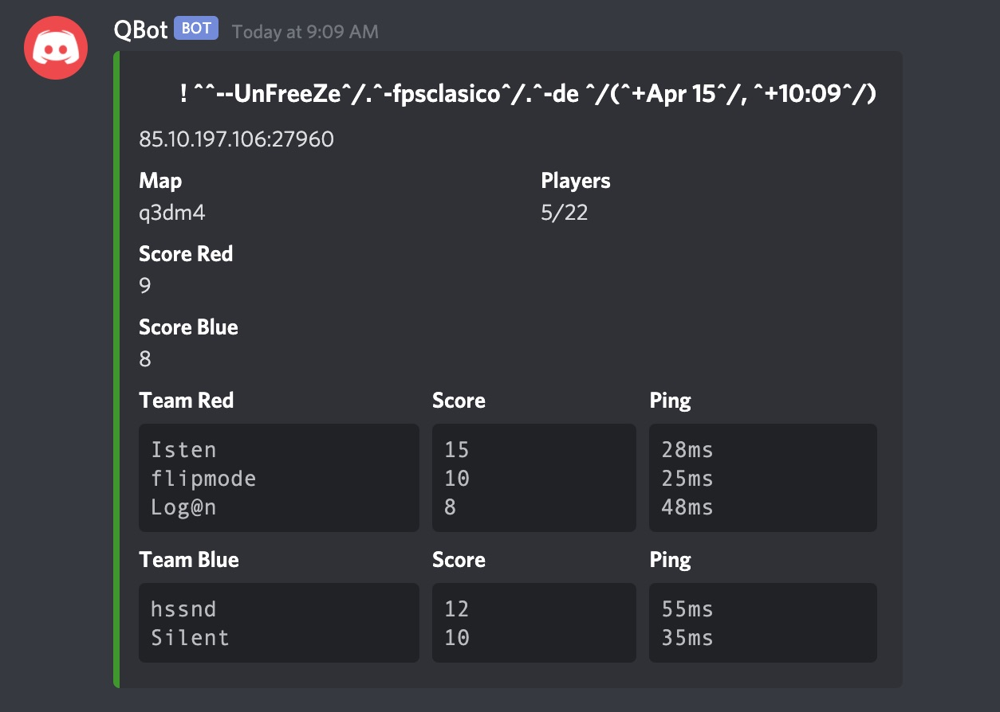

QBot
==============
A Discord bot written in Python to query Quake 3 servers based on the discord.py api wrapper.


### Installation

- Follow the steps listed [here](https://github.com/Rapptz/discord.py#installing) to install the `discord.py` library
- Get a token for your bot as described [here](https://github.com/reactiflux/discord-irc/wiki/Creating-a-discord-bot-&-getting-a-token)
- Make sure to enable the `Message Content Intent` in the bot's developer page
- Open `qbot.py` and copy/paste your token at the end of the file in the line that says `bot.run('your_token_here')`
- Optionally set up a list of aliases for servers you want to query often as described [here](https://github.com/andreagiavatto/QBot/issues/1)
- Run ```$ python3 qbot.py``` from the terminal

### Screenshot

